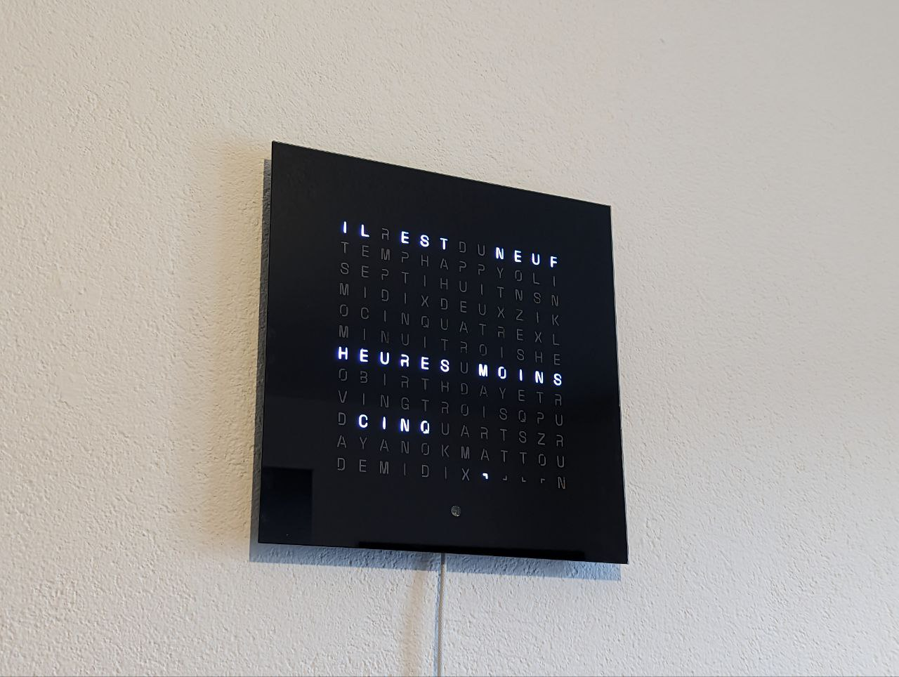
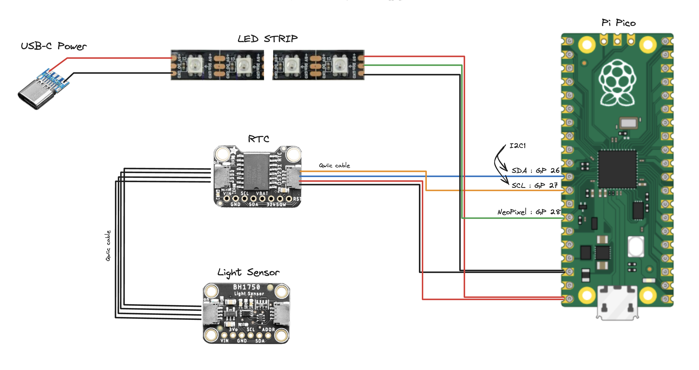
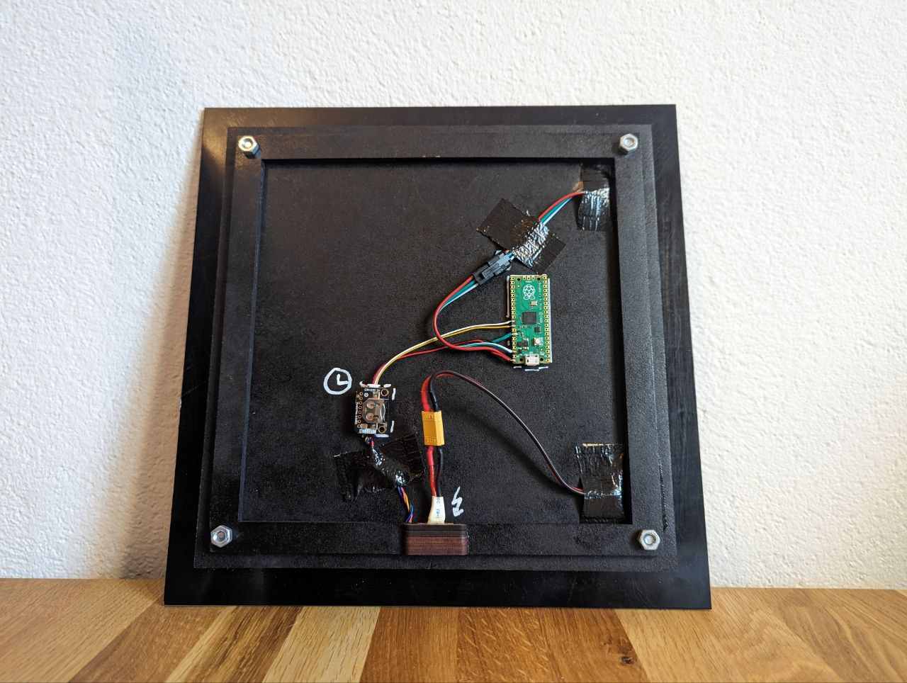
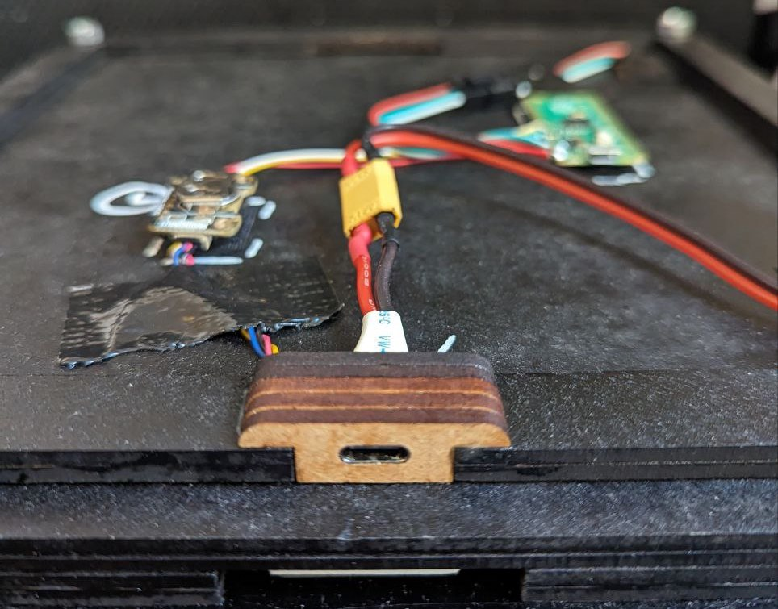

# Modular word-clock software for micropython



* Support the addition of new clock faces (other dimensions, language, layout,...)
* Compatible with neopixel led strips
* Light sensor based luminosity adjustment
* Create your own animations
* Asynchronous implementation
* USB-C power

## Sample wiring with Pi Pico





## Usage

### Install Requirements

```
python3 -m venv .venv
source .venv/bin/activate
pip3 install -r requirements-dev.txt
```

### Install code on rpi

```
mpremote cp -r src :
mpremote cp boot.py :.
mpremote cp main.py :.
```

### Set time

First, edit the time in `src/utils/set_date_time.py` so that it reflects the current time (plus a couple of seconds). Then run this command to set the time on the clock.

TODO: use the computer time to automatically set the clock time

```
mpremote run src/utils/set_date_time.py
```

### Dev

```
# run the main loop to catch any error
mpremote run main.py 
```