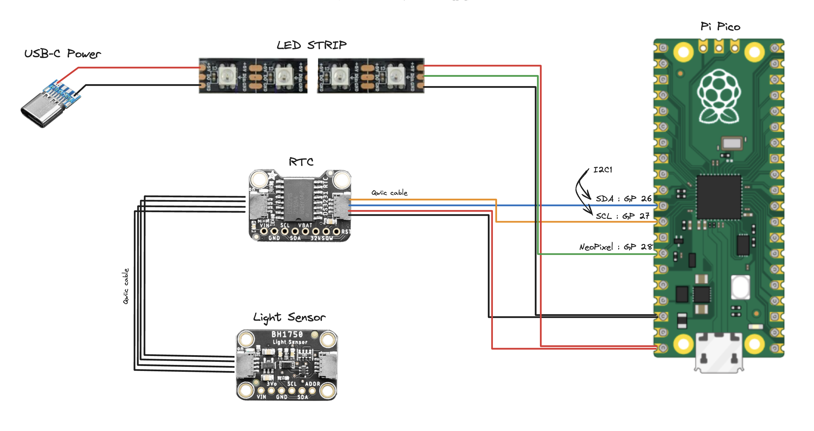
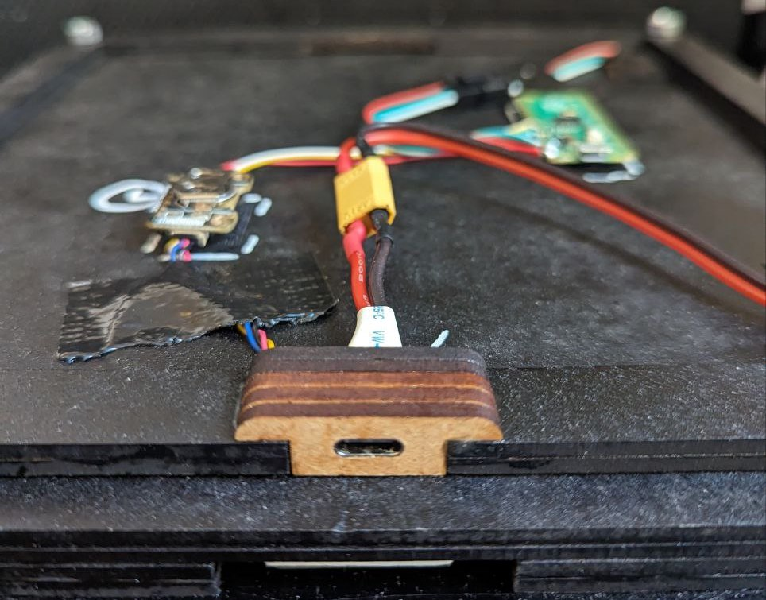

# Modular word-clock software for micropython


* Support the addition of new clock faces (other dimensions, language, layout,...). see `src/clock_face`
* Compatible with neopixel LED strips
* Custom designed PCB jumper to easily build the neopixel LED Matrix ([See /hardware/pcb_jumper](/hardware/pcb_jumper/))
* Light sensor based luminosity adjustment
* Create your own animations. see `src/rendering`
* Asynchronous implementation with asyncio

## Sample wiring with Pi Pico





## Usage

### Install Requirements

```
python3 -m venv .venv
source .venv/bin/activate
pip3 install -r requirements-dev.txt
```

### Install code on rpi
Plug Raspbery Pi via USB,

```
mpremote cp -r src :
mpremote cp boot.py :.
mpremote cp main.py :.
```

Unplug and plug the clock to restart it.

### Set time

First, edit the time in `src/utils/set_date_time.py` so that it reflects the current time (plus a couple of seconds). Then run this command to set the time on the clock.

TODO: use the computer time to automatically set the clock time

```
mpremote run src/utils/set_date_time.py
```

### Dev

```
# run the main loop to catch any error
mpremote run main.py 
```

## Build

See [/hardware](/hardware/) for build infos and files

* Glass front with die-cut sticker on the back
* USB-C powered
* Frame laser cut in 4mm MDF
* Custom PCB board to wire the LED matrix

Font used for the clock face: [wordclock-stencil-mono](https://github.com/mrudelle/wordclock-stencil-mono)
